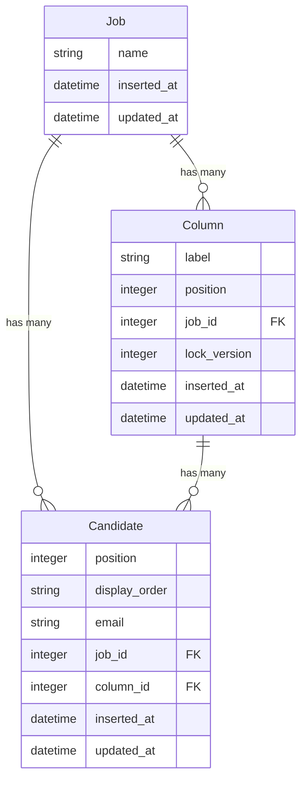

# Wttj


## Running the app via Docker

It may take a few minutes to build. 

```bash
docker-compose build phoenix
docker-compose up phoenix
```

The app should be running on [http://localhost:4001/](http://localhost:4001/).


## Things to note

### Commit history

I am aware that the commit history isn't ideal, as required in the brief. When learning a new framework, it's hard to implement changes in an atomic way. I have found it much easier to get things working and iterate later. 

I have since added refactoring and improved the documentation once I knew which methods/modules werent going to change.

### Known issue with display order

Currently, the display order property is still stored a string within Postgres, when it should be a float. This results sorting errors.

For example, if a column contains a candidate with a displayorder 10 or greater, and you try to drag a candidate afterwards, you will see the error "more than one candidate found within range". This is because "10" will appear before "9" when it is a string. 

### Lack of frontend testing

When I started this task, I decided not to implement frontend tests. I have taken the assumption that my ability to grasp Elixir is of more importance. So I have put more focus on the backend. 

That being said, if I were to have enough time, I would implement most of the frontend tests in Cypress.

`Write tests. Not too many. Mostly integration.` - Kent c. Dodds

I take the opinion that for the frontend, testing how the user interacts with the application is more important. So I would test the following scenarios:
The user moves the candidate to another list
The user moves the candidate to the top of the list

I would also add a few unit and snapshot tests where applicable. This could be for logic that has more complexity. For example, the `useCandidateMovedSubscription` hook skips events containing a matching clientId. That would be something that couldn't easily tested in Cypress.


# Documentation

## 1. Moving the column entity to the backend

The first issue I identified was the hardcoded status columns. I could see that there would be a potential need to customise these columns. 

Additionally, adding that functionality later in the development process would require redoing a lot of work. So I added the table `Column`.



With the new entity, I added `columnController` to the backend, and a `useColumn` hook to fetch the columns. The columns could be dynamically rendered in place of the hardcoded values.

## 2. Migrating to GraphQL

I decided to use GraphQL instead of API routes for a few primary reasons. 

Primarily, I wanted to try out GraphQL subscriptions for real-time updates. I've implemented web sockets in previous projects. I dislike how the logic for the WebSockets and the API routes is separate.

With GraphQL subscriptions, it fits into the same schema and can use the preexisting data types. 

The second reason is simply that the job description includes GraphQL. So it seemed like the perfect opportunity to try it out. 

The first step was to mirror the existing API routes with queries. I found this remarkably simple. Once I had defined the queries within the schema, I pointed them to a resolver module. Each resolver would then call the existing Context modules used by the controllers.

## 4. Adding drag and drop functionality

For drag and drop functionality, I used the library [@hello-pangea/dnd](https://yarnpkg.com/package?q=%40hello-pangea%2Fdnd&name=%40hello-pangea%2Fdnd).

I didn't have a lot of time to try out different libraries, but I picked this library because:
- It is easy to use
- It supports dragging between multiple columns
- It has over 1m downloads (so it must be pretty good)

Getting the drag and drop functionality working was surprisingly easy. The difficulty was in updating/maintaining the data. The library has a `onDragEnd` callback, which returns the result of what's been moved. 

One problem that I encountered, when moving a candidate to the top of the same list, the destination index doesn't account for the candidate already on the list. To handle this, you have to add an offset if the candidate is being moved up in the list.

## 5. Fractional Indexing

One of the technical requirements was to handle 10,000 candidates efficiently. One way to help with this goal is to reduce the number of database updates required.

Here is an example. Let's say you have two columns, you want to move a candidate from one to another. You have to update the index of every card in the second column. In this example, this requires updating four cards.


The second example uses fractional indexing. Instead of updating the index of the existing cards, we calculate a new index that fits in the middle (or in this case, before the first one). In this case, only the card that was moved needed to be updated.


The main downside to this approach is floating point precision. Eventually, the decimal places grow too long, causing rounding errors. 

You can see my implementation in the module `Wttj.Indexing`. The approach I took was to convert the floats to integers, calculate the difference, and then convert them back. 

I have since found that this approach doesn't fix the issue, and was unnecessarily complicated. I have not had time to fix the problem, but I have kept the module and tests for reference.

### Solution one - Reindexing

The first solution to this issue is to reindex every card within the column when necessary. We could test to see if a floating point rounding error has occurred. If this is the case, we select the candidates in order, and set the display order to the index. For example, the first result will be set to 1, then 2 etc.

### Type issues

Another issue that I have identified is the flipping between decimals, floats and strings. This is partly due to being used to typed languages such as C# and TypeScript. This frequent changing of types is unnecessary, makes the code more confusing, and probably has some minor performance impact.

## 6. Add MoveCandidate mutation

The next step was to add the mutation, so the frontend could send over the movement changes to the backend.

The schema calls the resolver `move_candidate/3`. The resolver will return `{:ok, object}` or `{:error, message}`. 

In this case, the resolver calls `Candidates.update_candidate_display_order`, which performs the following steps:

1. Validate the source and destination parameters are valid. For example, a request is sent to move a candidate between `3.0` and `4.0`. It will check that candidates with matching display orders exist, and it will check that no other candidates exist at those locations. 
2. Generates a new display order with the `Wttj.Indexing` module
3. Updates the candidate's display order


## 7. Handling updates on frontend

There are two main approaches to handling UI changes dependent on a server response, Pessimistic and Optimistic.

The pessimistic approach would wait for the server's response. If the response is successful, it will update the UI. If unsuccessful, it would show an error. A pessimistic approach would be a good solution for a messaging app.

The optimistic approach is to update the UI before we get a server response. When a user moves a candidate to another column, it will update immediately. In the background, the request is sent to the server. 

If the request is successful, the user won't see any changes. If the request fails, we would need to display an error message and revert the candidate back to the original state.

I chose the optimistic approach because it provides a better user experience. Errors are unlikely, and when they do, they are not the end of the world, as they are only moving a candidate from one column to another. 

## 8. Add Real Time functionality with graphql subscriptions

Finally, we get to add the real time sync.

First, you need to define a subscription schema. This is very similar to query and mutation schemas. You simply call the subscription query, and you will receive events. 

```ruby
  subscription do
    field :candidate_moved, :candidate_moved do
      arg(:job_id, non_null(:id))

      config(fn args, context ->
        {:ok,
         %{
           topic: "candidate_moved:#{args.job_id}",
           context: context
         }}
      end)
    end
  end
```

Here is the subscription query that im currently using:
```tsx

export const CANDIDATE_MOVED = gql`
subscription TestSubscription($jobId: ID!) {
  candidateMoved(jobId: $jobId) {
    candidate {
      id
      email
      jobId
      position
      displayOrder
      columnId
    }
    clientId
    sourceColumn {
      id
      lockVersion
    }
    destinationColumn {
      id
      lockVersion
    }
  }
}
`
```

The only parameter is the jobId. The jobId is used as a topic, filtering out any event for different jobs. 

You can define a trigger within the schema. This enables the events to automatically be published when the related entity is updated. However, I didn't like this approach. It felt a bit abstract and hard to test.

Instead, I use the Subscription module to manually publish the event when a candidate is updated.With this approach, I can specifically pass in the data I want, and its easier to test. I have setup the subscription module to be mockable.

```ruby
  def move_candidate(_parent, args, _resolution) do
    subscription_module =
      Application.get_env(:wttj, :subscription_publisher, Absinthe.Subscription)

    ## on success
    subscription_module.publish(
    WttjWeb.Endpoint,
    %{
        candidate: update.candidate,
        client_id: args.client_id,
        destination_column: update.destination_column,
        source_column: update.source_column,

    },
    candidate_moved: "candidate_moved:#{update.candidate.job_id}"
    )
    ## return response
  end
```

The code on the frontend is remarkably simple. It calls the callback whenever an event is published.

```tsx
  useSubscription<CandidateMovedSubscription>(CANDIDATE_MOVED, {
    variables: {
      jobId,
    },
    onData: handleOnSubscriptionData,
  })
```

### Skipping echos

Once the subscriptions were working, I noticed that events published by this client were also being received as events. Although this could be ignored, I felt it should be addressed.

The approach I took was to generate a clientId. This could be any value, a GUID would be ideal, it just needs to be a unique string.

```tsx
const clientId = useRef(Math.random().toString(36).substr(2, 9))
```

When updating a candidate, you must pass the clientId. The clientId gets passed from the resolver into the publish event. It's very simple to filters these events out.

```tsx
    if (clientId === candidateMoved.clientId) return
```

## 9. Adding Optimistic locking
The application needs to handle concurrent updates on the database. To address this problem, we need a way of identifying if a request is out of sync. 

To break down the problem in more simple terms:
1. The user sees the board in a specific state
2. The user moves a card from one column to another.
3. Updates are sent to the server based on that state

If the state has changed before the server receives the request, the change might be incorrect. It may be possible to calculate the result, but that would be very difficult and I simply don't have the time. 

The solution was to use optimistic locking. First, a `lock_version` property was added to the column table. 

 When the user moves a candidate, first it validates the request, with the assumption that the state is correct. After that: 
 1. Start a transaction. This wraps all of the database changes together. Either they all get applied, or the changes are reverted.
 2. Next, we lock the two columns. We need to ensure they're not updated during the transaction
 3. We compare the column version with the ones sent from the client. If they don't match, the request is out of date and must be rejected
 3. If the version matches, we update the candidate and increment the versions of both columns

# Potential improvements

## Slow UI updates

I noticed when setting up the the drag and drop functionality locally, it felt quite slow for updates to appear. This was before any network requests were included.

After slowing down the execution, I recorded moving a column within the profile menu. You can see the React update is very slow.


First of all, you can see that every candidate gets updated. Adding some caching by memoizing components in the list would reduce what needs to be updated. 

Secondly, the Draggable components certainly have a lot going on. The ones that aren't being updated could also probably be updated. 

Making the UI feel more reactive would be a higher priority to me than optimising the backend. Even if the backend is slightly slower, it shouldn't be too obvious due to optimistic UI updates.