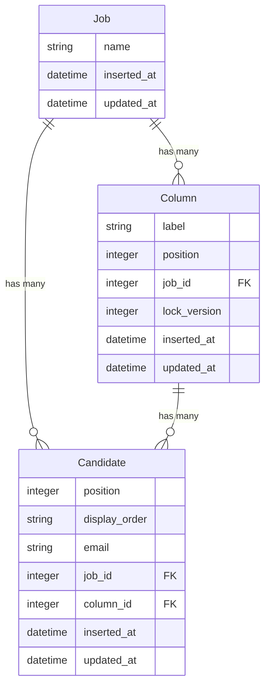
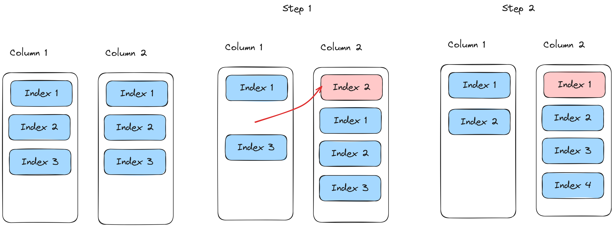
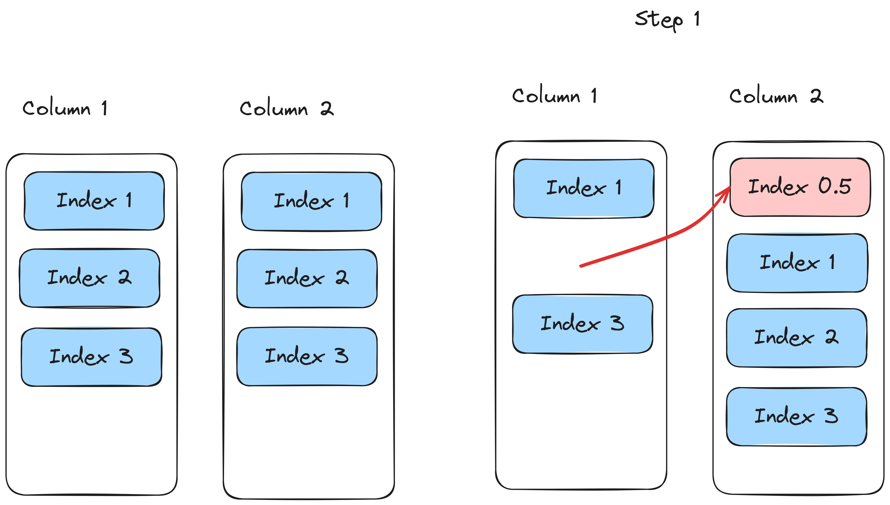
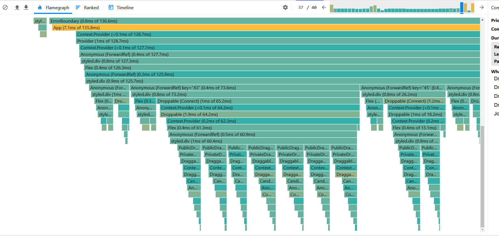

# Wttj

## Requirements

- Elixir 1.17.2-otp-27
- Erlang 27.0.1
- Postgresql
- Nodejs 20.11.0
- Yarn

## Getting started

To start your Phoenix server:

- Run `mix setup` to install and setup dependencies
- Start Phoenix endpoint with `mix phx.server` or inside IEx with `iex -S mix phx.server`
- install assets and start front

```bash
cd assets
yarn
yarn dev
```

### Running the app via Docker

It may take a few minutes to build. 

```bash
docker-compose build phoenix
docker-compose up phoenix
```

The app should be running on [http://localhost:4001/](http://localhost:4001/).


### Notes

The git/commit history is a bit messy. Its hard to implement everything in an atomic way when there is so much to do, and youre still learning the programming lanaugae. I refactored and added documentation subsequently once I knew things werent going to change. 

### Known issues

- Currently, the `display_order` property is still stored as a string within the database. If the value of `display_order` for any candidate exceeds 10, it breaks the ordering validation. This will be most noticable if you try drag a candidate to the end of a list, after 10. You will see the error message "more than one candidate found within range".


### tests

- backend: `mix test`
- front: `cd assets & yarn test`

Now you can visit [`localhost:4000`](http://localhost:4000) from your browser.

Ready to run in production? Please [check our deployment guides](https://hexdocs.pm/phoenix/deployment.html).

## Learn more

- Official website: https://www.phoenixframework.org/
- Guides: https://hexdocs.pm/phoenix/overview.html
- Docs: https://hexdocs.pm/phoenix
- Forum: https://elixirforum.com/c/phoenix-forum
- Source: https://github.com/phoenixframework/phoenix


# Documentation

## 1. Moving the column entity to the backend

The first issue I identified when viewing the applicaiton was the hardcoded columns, called Columns. 

I could see that there would be a potential need to customise these columns. Adding that functionality one the application had been developed would require redoing a lot of work. So I added the table `Column`.


With the new entity, I added `columnController` to the backend, a `useColumn` hook to the frontend and dynamically rendered the result.

## 2. Migrating to GraphQL

I decided to configure GraphQL in the project for a few primary reasons:
- I wanted to try out graphql subscriptions for real time updates. It just makes everything fit together very nicely (as opposed to having a seperate logic for API routes and websockets)
- I've not used Graphql before, so I wanted to try it out, given its in the job description
- Replacing multiple API calls with a single query simplifies the logic, and makes testing simpler

The first step was to simply setup query schemas to jobs, columns and candidates. The schema for each query calls a resolver, which could simply call the existing Context modules used by the controlers.

For the frontend, I replaced the three hooks with a single `useBoard` hook. Below is the most basic implementation of the useQuery.

```tsx
export const GET_BOARD = gql`
  query GetBoard($jobId: ID!) {
    job(jobId: $jobId) {
      id
      name
    }
    candidates(jobId: $jobId) {
      email
      id
      jobId
      columnId
      displayOrder
    }
    columns(jobId: $jobId) {
      id
      jobId
      position
      label
      lockVersion
    }
  }
`

  const { loading, error } = useQuery<{
    job: Job
    candidates: Candidate[]
    columns: Column[]
  }>(GET_BOARD, {
    variables: { jobId },
    onCompleted(data) {
      //
    },
  })
```


## 4. Adding drag and drop functionality

For drag and drop functionality, I used the library [@hello-pangea/dnd](https://yarnpkg.com/package?q=%40hello-pangea%2Fdnd&name=%40hello-pangea%2Fdnd).

I didnt have time to try out different libraries, but I picked this library because:
- It is easy to use
- It supports dragging between multiple columns
- It has over 1m downloads

Getting the drag and drop functionality working was very easy. The difficulty was in updating/maintaining the date. The library has a `onDragEnd` callback, which returns the result of whats been moved. 

To update the state, I have to work with:
- sourceList id
- destinationList id
- source index
- destination index

One problem that I encountered, when moving a candidate top the top of its own list, the destination index doesnt account for the candidate already being in the list. To handle this, you have to add an offset if the candidate is being moved up in the list.

## 5. Fractional Indexing

One of the technical requirements was to handle 10,000 candidates efficiently. One way to improve this is to reduce the number of database updates required.

Here is an example. Lets say you have two columns, you want to move a candidate from one to another. You have to update the indexing of every card in the second column. In this example, this requires updating four cards.



The second example uses Fractional indexing. Instead of updating the index of the existing cards, we calculate a new index that fits in the middle (or in this case, before the first one). In this case, only the card that was moved needed to be updated.



The main downside to this approach is floating point precision. Eventually, the decimal places grow too long.

You can see my implementation in the module `Wttj.Indexing`. The approach I took was to convert the floats to integers, calculate the difference, and then convert them back. I have since found that this approach doesnt fix the issue, and was unnecessarily complicated.

I have not had time to fix the problem, but I have kept the module and tests for reference.

### Solution one - Reindexing

The first solution to this issue is to reindex each column when necessary. We could test to see if a floating point rounding error occured. Is this is the case, we select the candidates in order, and set the display order to the index. For example, the first result will be set to 1, then 2 etc.

This is the orignal query that we were trying to avoid, due to multiple updates. But it would happen so infrequently, that I think its worth the tradeoff.

## Type issues

Another issue that I have identified is the flipping between decimals, floats and strings. This is partly due to being used to typed languages such as c# and typescript. I think this frequent changing of types is unnecessary, makes the code more confusing, and probably has some minor perfornace impact.

Secondly, the displayOrder is stored as a string in the database. It should be stored as a float, im not sure why I set it as a string. It has actually caused a bug in the application. If you try to move a candidate after a candidate with the index value of `10` or greater, it will return the error: `more than two candidates found within range`. This is because displayOrder is a string in the database, so this breaks the ordering. So `10` is actually being ordered before `9`. The obvious fix is to convert this field to a float.

## 6. Add MoveCandidate mutation

The next step was to add the mutation, so they frontend can send over the movement changes. The schema calls the resolver `move_candidate/3`. The resolver simply needs to return `{:ok, object}` or `{:error, message}`. In this case, the resolver simply calls `Candidates.update_candidate_display_order`.

`update_candidate_display_order` performs the following steps:

1. Validate the source and destionation parameters are valid. For example, a request is send to move a candidate between `3.0` and `4.0`. It will check that candidates with those displayOrders exist, and it will check that no other candidates exist at those locations. 
2. Generates a new displayOrder with the `Wttj.Indexing` module
3. Updates the candidates displayOrder

## 7. Handlign updates on frontend

There are two main approaches to handing UI changes dependent on a server response. Pessimistic UI would wait for the severs response. Then if successfulk, it would update the UI. This approach is safer, but will result in a slower feedback loop.

I chose to use optimistic UI changes. This means, when a user moves a candidate to antoher column, the update appears immediately on the page. It then sends the request to the API. 

Because im using fractional indexing, the frontend generates a temporary display order variable. If the response is successful, the candidate data will be seamlessly overritten.

However, if an update fails, it needs to be reverted. This should only happen due to a version conflict (I will discuss this in a separate section). When two users make a change at the same time, only one change can be made. However, given the type of data being updated (movign cards around a column), this is very unlikely to happen, and when it does, its not the worsr thing in the workd. Currently, it only shows an erorr message. But we could use add a friendly prompt that lets them know what happend.

## 8. Add Real Time functionality with graphql subscriptions

Finally, we're at the fun part. Real time sync.

First, you need to define a subscription schema. This is very similar to query and mutation schemas. You simply call the subscription query, and you will recieve events. 

```ruby
  subscription do
    field :candidate_moved, :candidate_moved do
      arg(:job_id, non_null(:id))

      config(fn args, context ->
        {:ok,
         %{
           topic: "candidate_moved:#{args.job_id}",
           context: context
         }}
      end)
    end
  end
```

Here is the subscription query that im currently using:
```tsx

export const CANDIDATE_MOVED = gql`
subscription TestSubscription($jobId: ID!) {
  candidateMoved(jobId: $jobId) {
    candidate {
      id
      email
      jobId
      position
      displayOrder
      columnId
    }
    clientId
    sourceColumn {
      id
      lockVersion
    }
    destinationColumn {
      id
      lockVersion
    }
  }
}
`
```

I pass in the jobId, because I only want to know when candidates are moved on the current job.

You can define a trigger within the schema. This enables the events to automatically be published when the related entity is updated. I didnt like this approach, it felt a bit abstract and hard to test.


Im specifically calling the subscription module to publish the events when a candidate is updated. With this approach, I can specifically pass in the data I want, and its easier to test. I have setup the subscription module to be mockable. WHen testing the resolver, I can check that the subscription is published to.

```ruby
  def move_candidate(_parent, args, _resolution) do
    subscription_module =
      Application.get_env(:wttj, :subscription_publisher, Absinthe.Subscription)

    ## on success
    subscription_module.publish(
    WttjWeb.Endpoint,
    %{
        candidate: update.candidate,
        client_id: args.client_id,
        destination_column: update.destination_column,
        source_column: update.source_column,

    },
    candidate_moved: "candidate_moved:#{update.candidate.job_id}"
    )
    ## return response
  end
```

The code on the frontend is remarkably simple. It simply calls the callback whenever an update appears.

```tsx
  useSubscription<CandidateMovedSubscription>(CANDIDATE_MOVED, {
    variables: {
      jobId,
    },
    onData: handleOnSubscriptionData,
  })
```

### Skipping echos

Once the subscriptions were working, I noticed that events published by this client were also being recieved as events. Although this could be ignored, I felt it should be addressed.

The approach I took was to generate a clientId. This could be any value, a GUID would be ideal, it just needs to be a unique string.
```tsx
const clientId = useRef(Math.random().toString(36).substr(2, 9))
```

When updating a candidate, you must pass the clientId. The clientId gets passed from the resolver into the publish event. Its very simple to filters these events out. I have this like in the callback method.

```tsx
    if (clientId === candidateMoved.clientId) return
```


## 9. Adding Optimistic locking

The application is real time, so it needs to handle concurrent operations on the database. For our usecase, we need to prevent a column being reordered when the original data is out of sync.


To break down the problem in more simple terms:
1. User sees the board in a specific state
2. User moves a card from one column to another. 
3. Updates are sent to the server based on that state

If the state has changed prior to the server recieving the request, the change might be incorrect. It may be possible to calculate the result, but that would be very dificualt and I simply dont have the time. 

To solve this problem, I used optimistic locking. To did this by adding a `lock_version` property to the column table. When the user moves a candidate, first it validates the request, with the assumtion that the state is correct. after that: 
    1. Start a transaction. This wraps all of the database changes together. Either they all get applied, or the changes are reverted.
    2. Next, we lock the two columns. We need to ensure they're not updated during the transaction
    3. We compare the columkn version with the ones sent from the client. If they dont match, the request is out of date, and must be rejected
    3. If the version match, we update the candidate, and increment the versions of both columns


## 10. Getting ready for realse (maybe remove)

# Potential improvements

## Slow UI updates

I actually noticed this when setting up the the drag and drop functionality locally. It felt quite slow for updates to appear. This is before any network requests were included.

After slowing down the execution, I recorded moving a column within the provile. It is showing the update as beign fairly slow.



First of all, you can see that every candidate gets updated. Adding some caching by momoizing components in the list would reduce what needs to be updated. 

Secondly, the Draggable components certainly have a lot going on. The ones that arent being updated could also probabably be updated. 

Making the UI feel more reactive would be a higher priority to me than optimizign the backend. Even if the backend is slightly slower, it shoudnt be too obvious due to optimistic UI updates.


## Basic Functionality


Ensure proper handling of card positioning and ordering
Maintain data consistency.


## Real-time Collaboration

Implement real-time synchronization between users
Handle concurrent operations gracefully
Choose and justify your real-time solution WebSocket, SSE, etc.)

## Performance Optimization

Design for scale: handle 10,000 candidates efficiently
Implement frontend optimizations (virtualization, pagination)
Optimize backend operations and database queries
Consider caching strategies

## Customization & Extensibility

Add candidate view
Support dynamic column creation and management
Design for future feature additions


Evaluation Criteria
 Code Quality & Architecture
Clean, maintainable, and well-documented code
Proper error handling and edge cases
Comprehensive test suite and high coverage
Thoughtful architectural decisions
🎛 Version Control
Clear, atomic commits with meaningful messages
Organized branching strategy
📝 Technical Documentation
Detailed README including: Setup instructions If there is no live demo URL provided, we should be able to set up and
run the application within a minute.), architecture overview, technical decisions and trade-offs, future improvements,
etc…
✨ Bonus
Online demo deployment
Docker containerization
E2E testing (e.g., Cypress)
CI/CD pipeline setup
Modern tooling and best practices
Security considerations